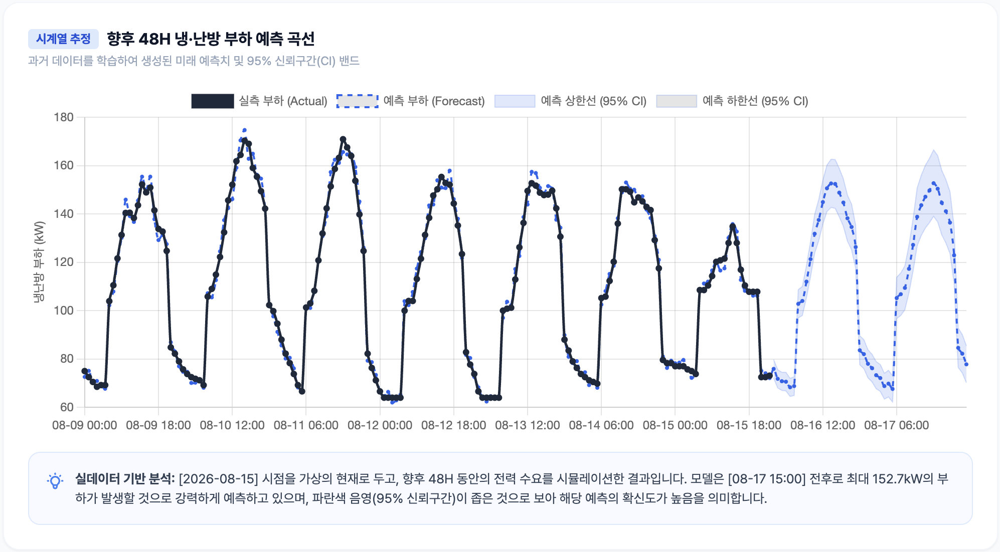

# codyssey_m1_1

# 🌤️ WeatherLoad: 기상 데이터 기반 전력 부하 시계열 분석 및 예측 시스템

## 📌 프로젝트 소개

**WeatherLoad**는 과거 기상청(KMA) 관측 데이터를 수집하여 **기상 조건(기온, 습도, 일조량 등)이 에너지 부하(냉/난방 전력 수요)에 미치는 영향을 탐색**하고, 시계열 분석 기법을 적용하여 **미래의 피크 부하를 예측**하는 통합 웹 대시보드입니다.

## 🚀 설치 및 실행 가이드 (Docker 환경)

본 프로젝트는 호스트 환경의 오염을 방지하고 일관된 실행을 위해 Docker 컨테이너 환경으로 구축되었습니다. 설정 파일들은 `docker/` 디렉토리에 모듈화되어 있으며, **프로젝트 루트 디렉토리**에서 아래 명령어를 통해 실행합니다.

**1. repository clone **

```bash
git clone https://github.com/smong2/codyssey_m1_1
cd https://github.com/smong2/codyssey_m1_1
```

**2. Docker Compose 빌드 및 실행**

```bash
docker compose -f docker/docker-compose.yml up -d --build
```

**3. 서비스 접속** 웹 브라우저를 열고 `http://localhost:8080` 에 접속하여 대시보드 및 리포트를 확인합니다. _(서버 중지: `docker compose -f docker/docker-compose.yml down`)_

---

## 🎯 1. 기능 요구사항 (Functional Requirements)

### 1-1. 분석 주제 및 데이터 선정

- **분석 주제:** 기상 조건 변화(기온, 습도, 일조량 등)가 도심 단위 표준 건물의 냉/난방 전력 부하(Load)에 미치는 영향 분석 및 단기 피크 부하 예측
- **데이터 출처:** 기상청(KMA) 종관기상관측(ASOS) 시간단위 API
- **데이터 규모:** 분석 대상 지역(서울 등) 기준, 선택 기간에 따라 최소 168시간(1주일) ~ 최대 수개월(수백~수천 데이터 포인트 이상)의 시계열 데이터 사용

### 1-2. 분석 질문 설정 (핵심 3가지)

본 프로젝트는 데이터 탐색(EDA) 및 모델링을 통해 다음 세 가지 핵심 질문에 답하고자 합니다.

1. **[관찰]** 기온(TA)이 특정 임계점(예: 24℃)을 넘을 때 전력 부하량(Load)이 어떻게 비선형적으로 급증하는가?
2. **[해석]** 하루 중 전력 수요가 가장 높은 피크 시간대는 언제 발생하며, 기온 및 일조량 곡선과 어떤 시차(Lag)를 갖는가?
3. **[예측]** 과거의 일주기 패턴을 학습한 시계열 모델은 향후 24~48시간 내의 '최대 피크 부하 발생 시점'을 얼마나 정확하게 짚어낼 수 있는가?

### 1-3. 시계열 분석 기법 적용 내용 설명

1. **파생 지표 생성 (Feature Engineering):** 단순 기온 데이터를 냉방도일(CDD), 난방도일(HDD), 불쾌지수(DI)로 변환하여 누적된 열(Heat)이 에너지 수요에 미치는 영향을 분석합니다.
2. **시계열 분해 (Decomposition):** 전력 부하 데이터를 점진적으로 증가/감소하는 **'추세(Trend)'**와 매일 오후 시간대에 급증하는 24시간 주기의 **'계절성(Daily Seasonality)'**으로 명확히 분리하여 시각화합니다.
3. **베이스라인 및 예측 (Forecasting):** Prophet 및 지수평활법(EMA) 모델을 활용하여 미래 부하를 시뮬레이션하고, 단순 이동평균(베이스라인)이 갖는 한계(계절성 추종 실패)를 비교 설명합니다.

---

## 💡 2. 과제 목표 (Learning Objectives) 달성 내역

### 2-1. 데이터 분석 사고

- **결측치 및 이상치 처리 (Audit Trail):** 데이터 수집 파이프라인에서 자동 정제 로직을 구현했습니다.
  - **기온/습도 결측치:** 시계열의 연속성을 유지하기 위해 직전 시간의 정상 값으로 대치하는 **Forward Fill (전방 대치법)**을 적용했습니다.
  - **일조량 특수코드(-9):** 야간 미관측 시 발생하는 -9 코드를 **0.0으로 일괄 변환**하여 통계 왜곡을 방지했습니다.
  - **이상치 캡핑:** 물리적 한계(기온 -35~45℃ 등)를 벗어난 데이터는 임계값으로 캡핑(Winsorizing) 처리했습니다.
- **관찰과 해석의 분리:** 대시보드 내에서 "14~15시에 부하가 가장 높다"는 **객관적 관찰**과, "건물에 누적된 복사열(CDD)이 에어컨 가동률을 임계점 이상으로 끌어올렸기 때문이다"라는 **가설적 해석**을 분리하여 리포트(REPORT.md)에 기술했습니다.

### 2-2. 시계열 데이터 이해

- 데이터가 가진 본연의 상승/하락 흐름인 **트렌드(Trend)**와 특정 주기로 반복되는 **계절성(Seasonality)**을 이해하고, 시계열 분해(Decomposition) 차트를 통해 이를 시각적으로 분리해 냈습니다.
- 백테스팅(예측) 페이지를 통해, 오차의 정규 분포(Residuals Zero-Mean)를 확인하여 모델의 예측 편향(Bias)이 존재하는지 통계적으로 진단하는 과정을 대시보드에 녹였습니다.

### 2-3. AI 활용 역량

- **프롬프트 엔지니어링 및 검증:** 단순히 코드를 복사하는 것에 그치지 않고, FastAPI의 라우터 분리 구조, React 컴포넌트 생명주기에 맞춘 비동기 렌더링, 레이아웃 겹침(Z-index) 해결 등 구체적이고 체계적인 요구사항을 AI에게 전달하여 개발 속도를 높였습니다.
- **주도적 문제 해결:** 서버 구동 시 발생한 `import_from_string` 에러나 `avg_load` 변수 스코프 에러 등 AI가 생성한 코드의 결함을 스스로 파악하고, 로직을 수정(예: `predict.py`를 `forecast.py`로 리팩토링)하며 프로젝트를 완성했습니다. AI의 출력을 맹신하지 않고 꼼꼼한 백테스팅을 거쳐 검증했습니다.

---

## 🛠 3. 대시보드 메뉴 구성

1. **홈 (대시보드):** 시스템 수집 현황 통계 및 스마트 폴백 헬스체크
2. **데이터 수집:** 기상청 API 연동, 달력 기반 데이터 탐색, 정제(Audit) 내역 확인
3. **탐색적 분석 (EDA):** 기온-전력 상관관계 산점도 및 CDD/HDD 누적 바 차트 분석
4. **시계열 예측 (Forecast):** Prophet 모델 기반 백테스팅, 시계열 분해 및 잔차 해석
5. **종합 리포트:** 선택 조건 기반 Markdown 변환 및 PDF 출력

## 4. 차트 예시

1. 예측 
2. EDA 
