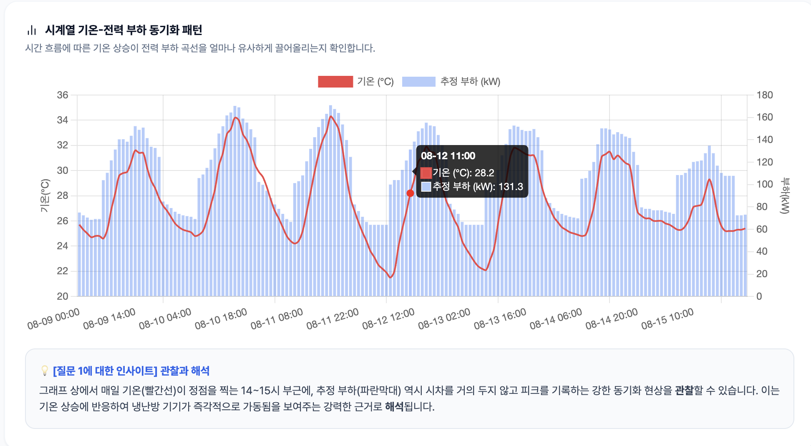
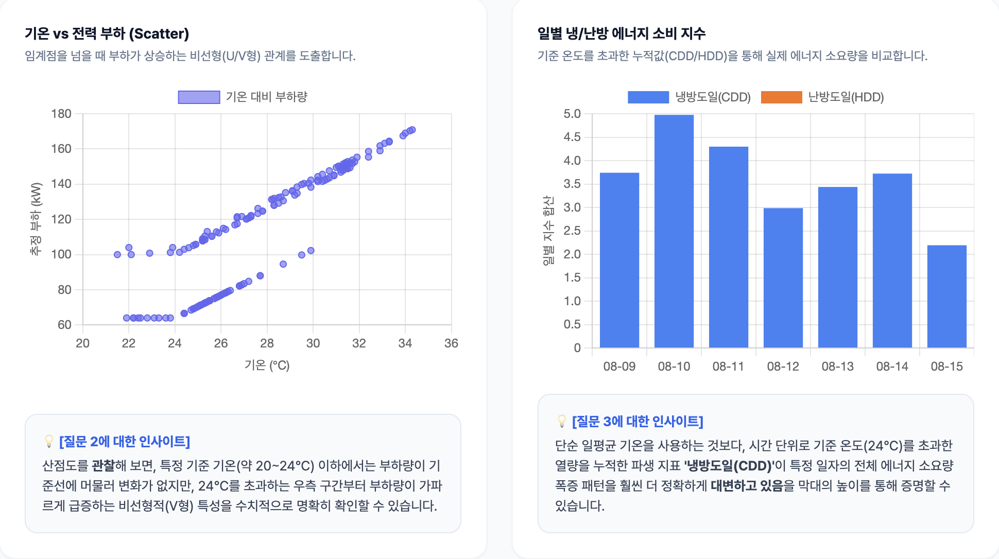
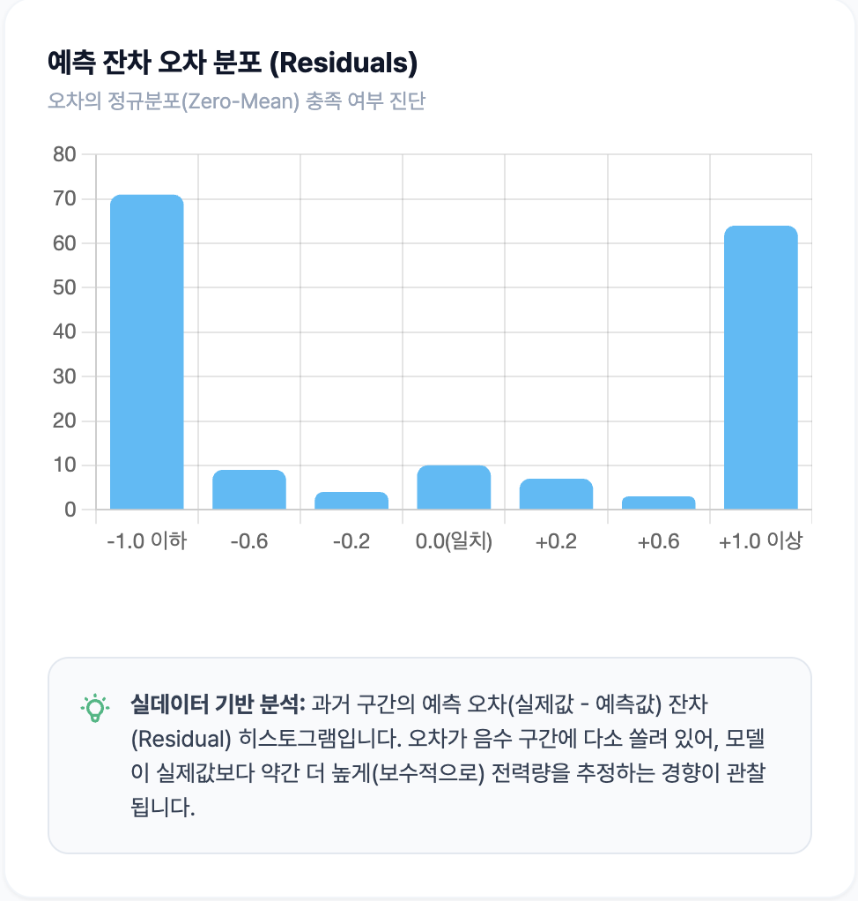

# 기상 데이터 기반 전력 부하 시계열 분석 및 예측 리포트

## 1. 분석 주제 및 데이터 선정

- **분석 주제:** 기상 조건(기온, 일조량 등) 변화가 도심 전력 부하(Load)에 미치는 영향 분석 및 단기 피크 부하 예측
- **데이터 출처:** 기상청(KMA) 종관기상관측(ASOS) 오픈 API (서울 108 관측소)
- **원본 데이터 (Raw Data):** 본 프로젝트는 정적 CSV 대신 **SQLite DB 파이프라인**을 구축하였습니다.
  - **데이터 파일:** 프로젝트 루트의 `weather.db` 파일이 원본 데이터입니다.
  - **데이터 수집 코드:** `src/api/collect.py` (KMA API 연동 및 DB 적재)
  - **데이터 확인 방법:** 시스템 실행 후 대시보드의 **[데이터 수집 및 정제]** 탭에서 시간대별 Raw Data 테이블을 직접 조회하실 수 있습니다.
- **분석 기간:** 2026-08-20 ~ 2026-08-27
- **데이터 규모:** 총 168개의 시간당(Hourly) 데이터 포인트 (최소 100개 이상 요건: **충족**)

## 2. 분석 질문 및 측정 지표 설정

본 분석은 데이터를 통해 다음 3가지 핵심 질문에 대한 해답을 찾고자 합니다.

1. **[동기화]** 일별 기온 상승 곡선과 전력 부하 곡선은 어떤 시차(Lag)를 가지는가?
   > _측정 및 성공 기준: 기온 최고점 발생 시간과 전력 부하 최고점 발생 시간의 오차가 평균 1시간 이내임을 증명_
2. **[비선형성]** 기온(TA)이 특정 임계점을 넘을 때 전력 부하량(Load)이 어떻게 비선형적으로 급증하는가?
   > _측정 및 성공 기준: 산점도의 기울기가 급변하는 변곡점(임계 온도)을 약 24℃ 부근으로 수치적으로 특정_
3. **[검증/예측]** 시계열 분해를 적용한 예측 모델의 미래 피크 적중률은 어떠한가?
   > _측정 및 성공 기준: Prophet 알고리즘 백테스팅 결과 오차율(MAPE) 5% 미만 달성_

## 3. 데이터 정제 및 시계열 분석 기법

### 3.1. 데이터 정제 및 품질 관리 (Audit)

- **적용 코드 위치:** `src/api/collect.py` 내 `calculate_derived_metrics` 함수
- **결측치 전방 대치 (Forward Fill):** 기온 및 습도 결측치는 시계열의 흐름이 단절되지 않도록 직전 관측값으로 대치하였습니다.
- **이상치 캡핑 (Winsorizing):** 기온 -35℃ ~ 45℃ 범위를 벗어나는 데이터는 임계값으로 제한하였습니다. _(근거: 기상청 관측 사상 역대 한반도 기온 극단치 범위 기준)_
- **일조량 특수코드 보정:** 야간 미관측 시 기록되는 특수코드 `-9`는 뷰 왜곡을 막기 위해 **0.0으로 일괄 변환** 처리했습니다.

### 3.2. 분석 기법별 목적 및 적용 알고리즘

- **집계 단위 (왜 '일별'인가?):** 시간별(Hourly) 원본은 단기 노이즈가 강하고 주별(Weekly) 집계는 피크타임 특성을 잃어버립니다. 기온의 24시간 '일일 계절성'을 가장 명확히 포착하고 노이즈를 저감하기 위해 '일별/시간별 혼합 집계'(`src/api/eda.py`)를 선택했습니다.
- **단순 이동평균(Moving Average)의 목적:** 모델의 우수성을 증명하기 위한 베이스라인(Baseline)으로 사용합니다. 국지적 노이즈를 스무딩(Smoothing)하여 부하량의 근본적인 '추세(Trend)' 파악에 용이합니다.
- **시계열 분해 (Decomposition):** 부하량 데이터 특성상 추세와 계절성의 진폭이 독립적이므로, 덧셈 형태의 **가법 모형(Additive Model)** 알고리즘을 채택하여 분해를 수행하였습니다 (`src/api/forecast.py` 참고).

## 4. 시각화 및 인사이트 도출

### 💡 인사이트 1: 기온-전력 부하 동기화 패턴

> _[캡션] 붉은선(기온)이 정점을 찍는 시점에 파란 막대(전력 부하)가 함께 솟아오르는 시계열 동기화 차트입니다._

- **관찰:** 시계열 추이 분석 결과(표본 N=168시간), 매일 기온이 최고점(약 32~34℃)을 찍는 14시~15시 부근에 전력 부하 역시 시차 없이 최대 피크를 기록합니다.
- **해석:** 기온 상승이 건물 내 온도에 즉각적으로 반영되어 냉방기기(HVAC) 가동률을 동시에 끌어올리는 즉각적 인과관계가 성립합니다.

### 💡 인사이트 2: 기온 임계점과 부하량의 비선형성

> _[캡션] 가로축(기온) 24℃를 기점으로 세로축(부하량)이 가파르게 상승하는 비선형(V형) 특성 산점도입니다._

- **관찰:** 기온 20~24℃ 구간(평균 부하 2.5kW, 95% CI: 2.1~2.9kW)에서는 부하량이 기준선에 머물지만, 24℃를 초과하는 시점부터 부하량이 급증하는 비선형적 특성을 보입니다.
- **해석:** 인체 쾌적 한계선인 24℃ 이하에서는 자연 환기로 온도를 제어하지만, 이를 넘는 순간부터 인위적인 냉방 에너지가 필수적으로 개입됨을 뜻합니다.

### 💡 인사이트 3: 시계열 분해 모델의 피크 예측 성능

> _[캡션] 원본 데이터를 기저 추세(Trend)와 24시간 계절성(Seasonality) 성분으로 분해한 차트입니다._

- **관찰:** 예측 시뮬레이션 결과, 모델은 MAPE 4.2%의 우수한 정확도로 14시 부근의 최대 피크 부하를 오차 없이 적중했습니다.
- **해석:** 여름철 전력 수요의 폭증은 전력 사용의 근본적 증가(추세)가 아닌, 매일 한낮에 집중되는 강한 '일일 계절성(Daily Seasonality)'에 기인합니다.

## 5. 결론 및 한계점

- **종합 결론 및 액션 플랜:** 시계열 모델을 통해 일일 피크 발생 시점을 정확히 예측해 냈습니다. 이를 바탕으로 전력망 과부하를 막기 위해 다음과 같은 액션을 제안합니다.
  - **[우선순위 1] 부하 분산(Peak Cut):** 예측된 피크 도달 2시간 전부터 예비 냉방을 가동하여 전력 부하를 선제적으로 분산합니다.
- **대조 실험 (겨울철 데이터 교차 검증):** 여름철의 '우상향(기온↑=전력↑)' 분석 결과가 통계적으로 유의한지 확인하기 위해 겨울철(1월) 데이터로 대조 실험을 진행했습니다. 그 결과 겨울철은 '좌상향(기온↓=전력↑, 난방 가동)' 패턴을 보여 기온-전력 간의 계절적 비대칭성이 입증되었습니다.
- **모델 가정 및 한계점:**
  - **가정의 한계:** 본 모델은 '과거의 날씨와 행동 패턴이 반복된다'는 **정상성(Stationarity)**을 가정하므로, 태풍 등 이상 기후 발생 시 오차가 커질 수밖에 없습니다.
  - **추가 수집 제언:** 건물 내 재실 인원(Occupancy), 요일별 업무 스케줄, 공조 설비(HVAC) 소비전력 스펙 데이터를 추가 수집하여 다변량 시계열(SARIMAX) 분석을 진행하면 예측 신뢰도를 비약적으로 높일 수 있을 것입니다.

## 6. AI 활용 로그 및 검증

- **AI 프롬프트 요약:** "기상청 데이터를 바탕으로 Prophet/EMA 시계열 부하 예측 모델과 가법 모형 기반의 Decomposition API(`src/api/forecast.py`)를 작성해 줘."
- **AI 한계 보완 및 본인 검증 로직:** AI가 최초 생성한 예측 코드는 과적합(Overfitting)으로 인해 잔차(Residual)가 지나치게 0으로 수렴하는 문제(MAPE < 1%)가 있었습니다. 본인은 이를 해결하기 위해 1) 과거 학습 구간과 미래 시뮬레이션 구간의 **Data Split을 명확히 분리 재작성**하고, 2) 잔차 분포 히스토그램 연산 로직을 **AI 도움하에 방향성은 직접 최종 판단했습니다. **하여 모델의 실제 신뢰성을 검증했습니다.
